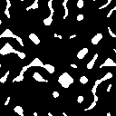

# ProjectEffigy - EffigyGen (Demo)

This is a partial mirror of the EffigyGen component of ProjectEffigy, for demonstration purposes only.

**Note**: Building this demo requires a local copy of ProjectEffigy. If you are viewing this as a demonstration, continue reading.

# Intro

ProjectEffigy is a multiplayer game with pseudo-random procedurally generated game maps.

EffigyGen is the cross-platform Rust library which generates deterministic pseudo-random complex game worlds. It can be compiled to any platform and reliably generate the game game world given the same seed and parameters. EffigyGen is compiled to native x86_64 (server) and WebAssembly (client).

# How it it used

*EffigyServer* -- Uses `effigy_gen::map_gen::MapGenerator` for procedurally generating and hosting an infinitely scaling game world.

*EffigyClient* -- Also uses `effigy_gen::map_gen::MapGenerator` to mirror the procedural generation of the server to avoid unnecessary network communication; merely sharing common seed + parameters is all that is needed for the server and client to procedurally generate the exact same map chunks.

# Visual Example

Let's walk through the generation of a game map.

```rust
let seed: u32 = 453537;
let map_chunks_size = MapChunkXY { x: 4, y: 4 };
let grid: MapGrid = MapGenerator::new(seed, &map_chunks_size)
    .with_terrain(0.2, 0.5)
    .with_buildings(0.1, 0.25)
    .with_water(0.2, 0.5)
    .with_trees(0.2, 0.5)
    .generate();
```

### 1. Create initial map chunks

A map is generated one `MapChunk` at a time, allowing for any specific `MapChunk` to be generated on-demand in any order. For this example, a randomly-appointed seed and parameters are declared for the `MapGenerator` to generate a grid of chunks (4x4 in this example, or 16 total chunks).

### 2. Add walkable and un-walkable terrain

Using a factory pattern, the `MapGenerator` takes in options for how the layers should be shaped.
```rust
    .with_terrain(0.2, 0.5)
```
This instructs the generator to create walkable terrain for players to walk on, mixing in un-walkable terrain.

In this example: `0.2` is the density (density of walkable vs. un-walkable terrain), and `0.5` is how scattered the mix of the two should be (`0.5` represents a medium amount of clumping).

This is done using ridged multi-layer Perlin noise. See: `effigy_gen::noise_gen::generate_landscape_noise`

First a raw noise image is generated...


Then the image is cropped to a binary map using a threshold...


This layer is saved to the game map where black is walkable terrain and white un-walkable terrain.

### 3. Add buildings

Next, the `MapGenerator` is instructed to add a layer of randomly placed buildings, avoiding overlap with existing terrain.

```rust
    .with_buildings(0.1, 0.25)
```
This instructs the generator to create small isolated buildings for players to interact with.

This is done using "Worley Manhattan" noise, which creates a series of cell-like shapes which are the perfect shape for buildings without being a simple square/rectangle. See: `effigy_gen::noise_gen::generate_buildings_noise`

A raw noise image is generated...then cropped to a binary map...then added as a logical layer.

  

(Buildings are marked in red)

### 4. Add water

Next, the `MapGenerator` is instructed to add a layer of randomly placed buildings, avoiding overlap with existing terrain.

```rust
    .with_water(0.2, 0.5)
```
This instructs the generator to create streams of water for the map.
- Control how continuous/unbroken the streams of water are by modifying the first argument.
- Control how wide/large the bodies of water are by modifying the second argument.

This is done using ridged multi-layer Perlin noise. See: `effigy_gen::noise_gen::generate_water_noise`

A raw noise image is generated...then cropped to a binary map...then added as a logical layer.

  

(Water is marked in blue)

### 5. Add trees

Next, the `MapGenerator` is instructed to add a layer of scattered trees, avoiding overlap with existing terrain and water.

```rust
    .with_trees(0.2, 0.5)
```
This instructs the generator to create scattered trees for the map.
- Control how clumped the trees are by modifying the first argument.
- Control how scattered the trees are within the clumps by modifying the second argument.

This is done using ridged multi-layer Perlin noise. See: `effigy_gen::noise_gen::generate_foilage_noise`

**Note**: Instead of using a single clamping function like in previous layers, using a middle clamping function creates a noisier scatter of points, which looks more like how trees exist in the wild.

A raw noise image is generated...then cropped to a binary map...then added as a logical layer.

  

(Trees are marked in green)

### 6. Collapse layers

With all the layers complete, the image now represents a complete game world map.


- White: terrain
- Red: buildings
- Green: trees
- Bue: water

Note: This example was created in the test `effigy_gen::map_gen_tests::generate_example_tile_grid`

```rust
#[test]
fn generate_example_tile_grid() {
    let seed: u32 = 453537;
    let map_chunks_size = MapChunkXY { x: 4, y: 4 };
    let grid: MapGrid = MapGenerator::new(seed, &map_chunks_size)
        .with_terrain(0.2, 0.5)
        .with_buildings(0.1, 0.25)
        .with_water(0.2, 0.5)
        .with_trees(0.2, 0.5)
        .generate();

    // ... assertions

    #[cfg(feature = "images")]
    save_map_grid_as_image(&grid, &format!("map_gen_{}.png", seed)).unwrap();
}
```

### 7. Render in-game as 3D

The generated image can now then be interpreted as a game world map with each color representing a feature on the map. Chunks can be generated on-demand as the player traverses across the grid.

